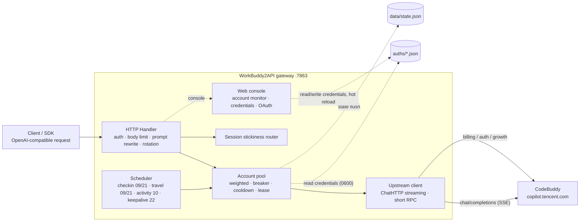

<p align="center">
  
</p>

<h1 align="center">WorkBuddy2API</h1>

<p align="center">
  <b>Turn Tencent CodeBuddy accounts into an OpenAI-compatible API multi-account gateway</b><br>
  OAuth login · account pool rotation · circuit breaking &amp; cooldown · session stickiness · scheduled check-in / activity / travel / keepalive · streaming / non-streaming
</p>

<p align="center">
  
  
  
  
</p>

<p align="center">
  <a href="README.md">中文</a> · <b>English</b>
</p>

---

## Introduction

WorkBuddy2API is a self-hosted **OpenAI-compatible reverse-proxy gateway** that wraps Tencent CodeBuddy (`copilot.tencent.com`) accounts behind a unified `/v1/chat/completions` service.

- CodeBuddy offers no OpenAI-style public API. This project obtains account credentials via **OAuth device authorization** (`login.sh`), then handles token refresh, account-pool scheduling and traffic governance on the gateway side.
- Built for **personal multi-account** setups: accounts share load, a failing account is swapped out automatically, cooldown / circuit breaking prevents cascading failures, and session stickiness keeps multi-turn context on the same account.
- Clients only ever see an OpenAI-compatible interface, so existing SDKs / front-ends / tools work **with zero changes**.

> ⚠️ **Compliance notice**: this is an **unofficial** gateway using CodeBuddy accounts as upstream. It is intended **only for your own authorized accounts, in local / private testing environments**. See [Security &amp; Compliance](#security--compliance) for the full boundary.

## Features

| Feature | Description |
|---|---|
| 🔑 **One-command OAuth login** | `login.sh` device-authorization flow; credentials are persisted and the container restarts to load the new account |
| 🔄 **Multi-account pool** | Three-factor weighted random selection (credit share ×10 + idle bonus + success rate ×3), top-5 candidates with anti-thundering-herd |
| 🛡️ **Circuit breaking &amp; cooldown** | 429 soft cooldown from 600s with exponential backoff (capped by `soft_rate_max`); fixed 60s cooldown on 404; 402 hard cooldown until 04:00 next day; breaker on consecutive failures; in-flight lease limiting |
| 🧲 **Session stickiness** | A conversation (`conversation_id`) sticks to one account where possible; rolling TTL, auto-unbind on failure; **availability is evaluated per model** — when a model hits a 6004 limit, the session is immediately reassigned |
| 💰 **Cost-aware selection** | Records observed billing (`usage.credit`) per `(account, model)` and prefers free / cheaper accounts — the same model automatically prefers accounts still inside a free-tier window |
| ⏰ **Scheduled tasks** | Check-in (09:00/21:00) + activity reporting (10:00, lights up streaks / unlocks adoption + streak self-check) + cat travel (09:00/21:00, independent schedule) + token keepalive (22:00); all four independently switchable |
| ⚡ **Streaming + non-streaming** | Upstream forced to `stream:true`; SSE frames rebuilt against a spec whitelist; non-streaming requests are aggregated locally into a single response |
| 🧠 **Reasoning-model support** | DeepSeek chain-of-thought injection (`thinking.type=enabled` + default tier), `reasoning_content` multi-turn backfill, automatic `reasoning_effort` tier downgrade |
| 💬 **System-prompt subsystem** | The gateway substitutes its own prompt for the client's `system` (default `custom`), eliminating content false-positives at the source; `passthrough` mode retries with a neutral prompt when blocked |
| 🗑️ **Fingerprint sanitizing** | Blacklisted fingerprint fields are stripped from outgoing request bodies (can be disabled); stacks with the prompt subsystem |
| 📊 **Observability** | One tabular log line per request (TTFB / token rate / uid); `/healthz` carries a `service` identity marker for load balancers and host probes |
| 💾 **State persistence** | Pool state is atomically written to `data/state.json` (every 5s, plus a forced flush on exit); credits / cooldown / breaker state survive restarts. **Zero external dependencies** (see below) |

The table below covers Web-console capabilities; see [Web Console](#web-console) for details.

| Feature | Description |
|---|---|
| 🖥️ **Built-in Web console** | Served **on the same port and origin** as the API (`/`), so there is no CORS. Dark / light themes. Panels for overview, accounts, models, usage, playground, client setup and settings |
| 🔐 **Console login** | Once `console_password` is set, **both the pages and the `/api/*` management endpoints** require login. Session cookie (HttpOnly, 7 days, in-memory only); brute-force protection (5 failed attempts per IP locks for 5 minutes) |
| 🧭 **Account status monitoring** | Actually queries upstream for **quota, check-in state, streak days and available models**, with a 30s cache. Each item degrades independently, and check-in can be triggered with one click |
| 🗂️ **Online credential management** | List / delete / rescan `auths/` credentials from the console; add by pasting a token; changes take effect **hot, without a restart**; the credentials endpoint never returns raw tokens |
| 🔗 **Web-based OAuth** | Click a button to generate a CodeBuddy login link, sign in through your browser, and the credential is persisted and hot-loaded — **no SSH required** |
| 📈 **Token usage statistics** | Aggregated over 1h / today / 24h / 7d / all, with a totals board, SVG area chart, model ranking and account distribution |

## Architecture



Before leaving the gateway, every upstream request passes through a unified rewrite pipeline (`internal/upstream/payload.go`): force `stream:true`, normalize the `developer` role, normalize `tool_choice`, inject DeepSeek chain-of-thought, downgrade `reasoning_effort`, backfill `reasoning_content`, and sanitize fingerprints.

## Web Console

The console is served **on the same port and origin** as the API: the gateway provides both the `/v1/*` endpoints and the `/` front-end from `:7863`, so every front-end request is a same-origin relative path — **there is no CORS to deal with**.

Just open `http://<gateway-host>:7863/` (works over LAN or public IPv6).

### Enabling login

Set `console_password` in `config.json`:

```json
{
  "listen": ":7863",
  "console_password": "choose-your-own-password"
}
```

- Empty or absent means **login is disabled**, and behaviour is exactly as before this feature existed.
- When set, **both the pages and the `/api/*` management endpoints** require login. Unauthenticated browser navigation is redirected to `/login.html`; unauthenticated API calls get a 401 JSON response.
- Session cookie `wb_session`: HttpOnly (unreadable from JS), SameSite=Lax, 7-day lifetime, **in-memory only** (a process restart invalidates it).
- Brute-force protection: 5 consecutive wrong passwords from one IP locks that IP for 5 minutes.
- Can also be set via the `WB2A_CONSOLE_PASSWORD` environment variable.

**Always open** (no login required): `/healthz` (health probing), `/login.html` and its static assets, and `/v1/*` (which uses its own Bearer auth).

### Panels

| Panel | Contents |
|---|---|
| **Overview dashboard** | Total / healthy / cooling / disabled account counts, gateway latency, account preview |
| **Account status** | Per-account card: quota bar with plan name and cycle end, check-in state with a one-click button, available-model tags, success rate / in-flight / soft-cooldown |
| **Credentials** | Credential list (nickname, file name, token state and remaining validity, whether it can auto-refresh), delete, rescan, manual token paste, and **OAuth sign-in** |
| **Model catalogue** | Available models (fetched dynamically, falling back to a static table), searchable, one click to load into the playground |
| **API playground** | Streaming chat in the browser with live TTFB and token-rate readouts |
| **Token usage** | Four-card board + SVG area chart + model ranking + account distribution over 1h / today / 24h / 7d / all |
| **Client setup** | One-click config copy for Cherry Studio, Chatbox and similar clients |
| **Settings** | Gateway address and online `api_key` generation / sync |

### About account-status queries

The **Account status** panel genuinely calls upstream endpoints (quota, check-in, available models, streak). Therefore:

- Results are cached for **30 seconds** so repeated refreshes cannot hammer upstream; `?refresh=1` forces a fresh query.
- There is **no automatic polling** — requests happen only when you first open the panel or press "Refresh all".
- Each item **degrades independently**: a failure in one query shows an error in that spot without affecting the others.

### OAuth sign-in from the browser

No SSH needed; the whole flow happens in the browser:

1. **Credentials** → **Add account via login** → **Generate login link**.
2. Open the link in a new window and complete the CodeBuddy sign-in.
3. Return to the console and press **I've signed in, check status**.
4. The credential is written to `auths/` and hot-loaded, taking effect immediately.

> **Implementation note**: the account identity used when persisting the credential comes from the **JWT `sub`** claim (measured to be exactly equal to `account.uid` in the credential file), not from the token response body. The token response does not return `uid`; if a hash-derived identifier were used instead, **signing into the same account twice would create two entries in the pool**, and the scheduler would rotate between them as if they were separate accounts — silently burning quota.

## Quick Start

### Requirements

- **Docker + Docker Compose** (recommended; the image already contains a low-privilege `app` user and all tooling scripts)
- One or more registered CodeBuddy accounts for OAuth login
- Host Go ≥ 1.22 (only needed for building from source)

### Docker Compose

```bash
git clone https://github.com/Sliverkiss/workbuddy2api.git
cd workbuddy2api

# 1. Prepare config
cp config.example.json config.json
#    Edit config.json: set api_key and, for public exposure, console_password.

# 2. Log in and add an account (repeat to add more)
./login.sh

# 3. Start
docker compose up -d

# 4. Health check (503 when no account is usable); the `service` field
#    confirms you reached this gateway
curl -s localhost:7863/healthz
# {"healthy":2,"total":3,"service":"workbuddy2api"}
```

Then open `http://localhost:7863/` for the Web console.

### Building from source

```bash
go build -o wb2api ./cmd/server
./wb2api -config config.json
```

The gateway serves the console from `./web` when `cfg.WebDir` is unset, so a fresh clone runs without extra steps.

### Verifying

```bash
# Models
curl -s localhost:7863/v1/models -H "Authorization: Bearer $API_KEY"

# Account status (summary + per-account detail; disabled accounts expose disabled_reason)
curl -s localhost:7863/status -H "Authorization: Bearer $API_KEY"

# Streaming chat
curl -N localhost:7863/v1/chat/completions \
  -H "Authorization: Bearer $API_KEY" \
  -H "Content-Type: application/json" \
  -d '{"model":"auto","stream":true,"messages":[{"role":"user","content":"hi"}]}'

# Non-streaming chat (aggregated locally)
curl -s localhost:7863/v1/chat/completions \
  -H "Authorization: Bearer $API_KEY" \
  -H "Content-Type: application/json" \
  -d '{"model":"auto","messages":[{"role":"user","content":"hi"}]}'
```

## Configuration

### Field reference

| Field | Default | Notes |
|---|---|---|
| `listen` | `:7863` | Listen address |
| `api_key` | empty | Empty = `/v1/*` requires no auth |
| `console_password` | empty | Web-console login password; empty = disabled. Also `WB2A_CONSOLE_PASSWORD` |
| `auth_dir` | `./auths` | Credential directory |
| `state_file` | `./data/state.json` | Pool-state file |
| `server.max_body_mb` | `8` | Request-body limit (MB); exceeding it returns 413 rather than truncating |
| `cooldown.soft_rate` | `600s` | Base soft-cooldown duration |
| `cooldown.soft_rate_max` | `2h` | Exponential-backoff cap for soft cooldown |
| `schedule.*` | see example | Four independent schedules, each with its own `*_enabled` switch |
| `upstream.timeout_seconds` | `120` | Total budget for short RPCs (token refresh / check-in / balance / model list) |
| `upstream.header_timeout_seconds` | `120` | Time allowed before the chat SSE **first byte**; timeout means re-dispatch on another account |
| `upstream.idle_timeout_seconds` | `300` | Maximum **idle gap mid-stream**; active data keeps the stream alive |
| `upstream.user_agent` | empty | Outgoing User-Agent override |
| `features.sanitize_blacklist_fingerprints` | `true` | Strip blacklisted fingerprint fields from outgoing bodies |
| `prompt.mode` | `custom` | `custom` = gateway substitutes its own prompt; `passthrough` = forward the client's `system` |
| `prompt.file` | empty | Prompt file path; empty = built-in default (~2KB) |
| `pool.max_in_flight` | `3` | Max concurrent requests per account (`0` = unlimited) |
| `pool.breaker_threshold` | `3` | Consecutive failures that trip the breaker |
| `pool.breaker_cooldown` | `30m` | Base breaker backoff |
| `pool.breaker_cooldown_max` | `6h` | Breaker backoff cap |
| `pool.idle_weight_per_hour` | `0.5` | Idle-compensation weight gained per unused hour |
| `pool.idle_weight_max` | `5.0` | Idle-compensation cap |
| `session_sticky.enabled` | `true` | Enable session stickiness |
| `session_sticky.ttl` | `30m` | Binding TTL (rolling) |
| `session_sticky.gc_interval` | `5m` | Expired-binding GC interval |

### Upstream timeout semantics

Chat streams (both `stream: true` and `false`) have **no total-duration limit**: chat uses a dedicated client with `Timeout=0`, so long reasoning or long outputs are never cut off.

### Environment-variable overrides

Load order: JSON file → `WB2A_*` environment variables (a non-empty variable overrides):

`WB2A_LISTEN` · `WB2A_API_KEY` · `WB2A_CONSOLE_PASSWORD` · `WB2A_AUTH_DIR` · `WB2A_STATE_FILE` · `WB2A_MAX_BODY_MB` · `WB2A_SOFT_RATE`(duration) · `WB2A_SOFT_RATE_MAX`(duration) · `WB2A_TIMEOUT_SECONDS` · `WB2A_HEADER_TIMEOUT_SECONDS` · `WB2A_IDLE_TIMEOUT_SECONDS` · `WB2A_USER_AGENT` · `WB2A_SANITIZE_FINGERPRINTS`(bool) · `WB2A_PROMPT_MODE` · `WB2A_PROMPT_FILE`

## API Endpoints

### Service endpoints

| Endpoint | Auth | Notes |
|---|---|---|
| `POST /v1/chat/completions` | Bearer (when `api_key` is set) | OpenAI-compatible completion; streaming / non-streaming; body limit `server.max_body_mb` (8 MB default) |
| `GET /v1/models` | Bearer (when `api_key` is set) | Model list (fetched dynamically, cached 1h; falls back to a static table with a 5-min negative cache) |
| `GET /status` | Bearer (when `api_key` is set) | Account summary + per-account detail (credits / cooldown / breaker / in-flight / sticky; disabled accounts expose `disabled_reason`) |
| `GET /healthz` | none | 200 when at least one healthy account can serve, otherwise 503; response carries an identity marker |

> Auth rule: `Authorization: Bearer <api_key>` is checked **only when `api_key` is non-empty**; **when `api_key` is empty these endpoints are open**; `/healthz` never requires auth.

**Console management endpoints** (require login when `console_password` is set, see [Web Console](#web-console)):

| Endpoint | Method | Notes |
|---|---|---|
| `/` | `GET` | Web console (same port and origin as the API) |
| `/login.html` | `GET` | Login page (open) |
| `/api/login` | `POST` | Sign in; sets the `wb_session` cookie |
| `/api/logout` | `POST` | Sign out; revokes the current session |
| `/api/session` | `GET` | Current login state |
| `/api/accounts/status` | `GET` | Deep account status (quota / check-in / models); `?uid=` single, `?refresh=1` bypasses the 30s cache |
| `/api/accounts/checkin` | `POST` | Trigger check-in manually (`?uid=`) |
| `/api/credentials` | `GET` | Credential list (**sanitized — raw tokens are never returned**) |
| `/api/credentials/upload` | `POST` | Add a credential by pasting a token |
| `/api/credentials/delete` | `POST` | Delete a credential (path-traversal guarded) |
| `/api/credentials/reload` | `POST` | Rescan `auths/` and hot-update the pool |
| `/api/credentials/oauth/start` | `POST` | Request a CodeBuddy login link |
| `/api/credentials/oauth/poll` | `POST` | Poll the login result and persist the credential |
| `/api/key` | `GET`/`POST` | Read / update the gateway `api_key` |
| `/api/usage` | `GET` | Token-usage aggregates (`range=1h\|today\|24h\|7d\|all`) |
| `/api/usage/clear` | `POST` | Clear usage history |

> ⚠️ `/v1/*` uses its **own Bearer `api_key` auth** and is unaffected by console login. If `api_key` is empty and the port is publicly reachable, **anyone can spend your quota** — always set `api_key` for any public deployment.

## Request Logs

Each `/v1/chat/completions` request emits one tabular log line on stdout:

```text
| #001 | 18:31:31 | deepseek-v4 | stream | 200 | uid=0851ce35 | TTFB=801ms | tok=60 | 23.5tok/s | total=2.6s |
```

| Field | Meaning |
|---|---|
| `#001` | Process-wide request sequence number |
| `18:31:31` | Completion time |
| `deepseek-v4` | Model name (truncated past 11 characters) |
| `stream` / `sync` | Request mode |
| `200` | Status code |
| `uid=0851ce35` | Account UID prefix (first 8 characters) |
| `TTFB` | Time to first byte |
| `tok` | Output tokens |
| `tok/s` | Output token rate |
| `total` | Total duration |

## Deployment & Operations

### Docker image

```bash
docker compose up -d --build     # build and start
docker compose logs -f           # follow logs
docker compose restart           # restart (reloads credentials)
docker compose down              # stop
```

### Account management

```bash
./login.sh          # add an account via OAuth device flow
ls auths/           # credential files (mode 0600)
```

Alternatively, manage credentials entirely from the Web console (**Credentials** panel) — including OAuth sign-in, deleting and hot-reloading, with no SSH required.

### Backups

- Back up `auths/` (credentials) and `data/state.json` (pool state: credits / cooldown / breaker / counters).

## Security & Compliance

### 1. Credential handling

- Credential files live in `auths/` with mode `0600` and are **never committed** (see `.gitignore`).
- The `/api/credentials` endpoint returns a **sanitized view only** — token values are never included in any response.
- `config.json` (which may contain `api_key` and `console_password`) is git-ignored; use `config.example.json` as the template.

### 2. Network exposure

- **Set `api_key` before exposing the port publicly.** `/v1/*` is a separate auth channel from console login; with an empty `api_key` anyone who can reach the port can spend your quota.
- Set `console_password` to protect the console and the `/api/*` management endpoints.
- Enable HTTPS at your reverse proxy if the gateway is reachable from the internet.

### 3. Release provenance

This repository is a fork of [`Sliverkiss/workbuddy2api`](https://github.com/Sliverkiss/workbuddy2api) (MIT). Upstream copyright and the `LICENSE` file are retained.

### 4. Authorized-use boundary

This project is an **unofficial** gateway. Use it only with **accounts you are authorized to use**, in **local or private testing environments**. Do not use it to provide public services, resell access, or circumvent upstream terms of service.

## FAQ

### What is the `go-redis` / Upstash situation?

**Removed.** The gateway is a single-instance deployment: session bindings and pool state are fully expressed in memory plus `data/state.json`. The optional Upstash Redis mirror was never actually used (with no Upstash configured it always took the no-op path) yet pulled in 5 third-party modules. Removing it cut the binary by **983,040 bytes (13.2%)** and left `go.mod` with **zero external dependencies**. Legacy `upstash.*` keys in an old `config.json` are simply ignored.

### Why does check-in run twice a day?

The default schedule is 09:00 and 21:00 (server-local, exactly on the hour). Check-in is idempotent — the second run typically reports "already checked in", which is treated as success, not an error. After check-in the gateway also re-queries the balance and **unfreezes accounts that were cooling down due to insufficient credit**.

### How do I recover an account that was disabled?

A `disabled` account stays disabled after a restart (that is intentional — it prevents a dead account from being retried forever). Re-authenticate it from the console, or edit its credential file in `auths/` and reload.

### Server clock and timezone?

Scheduled tasks use the process's local timezone. In Docker, set `TZ` (for example `TZ=Asia/Shanghai`) so the hour lists mean what you expect.

## Feedback & Issues

Issues are welcome via GitHub. Please include the gateway version, relevant log lines (with secrets removed), and the exact request that reproduced the problem. **Never paste real credentials or tokens into an issue.**

## Disclaimer

This project is provided for learning and personal use only. Users are responsible for complying with CodeBuddy's terms of service and all applicable laws and regulations. The authors accept no liability for account restrictions or any other consequences arising from use of this software.

## License

[MIT](LICENSE) — Copyright (c) 2026 [Sliverkiss](https://github.com/Sliverkiss)
