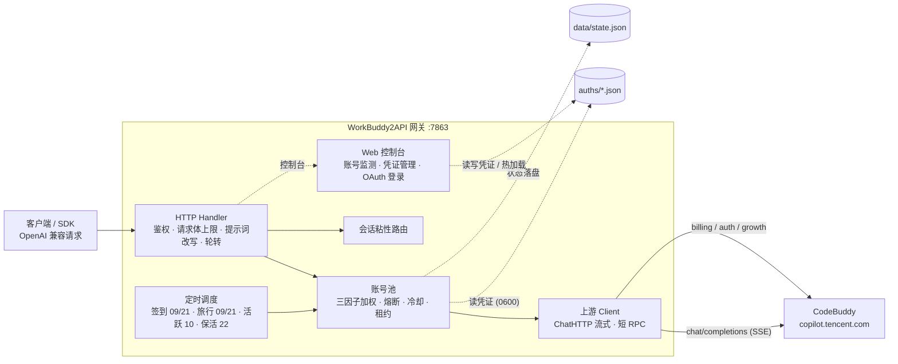

<p align="center">
  
</p>

<h1 align="center">WorkBuddy2API</h1>

<p align="center">
  <b>把腾讯 CodeBuddy 账号变成 OpenAI 兼容 API 的多账号网关</b><br>
  OAuth 登录 · 账号池轮转 · 熔断与冷却 · 会话粘性 · 定时签到 / 活跃 / 旅行 / 保活 · 流式 / 非流式
</p>

<p align="center">
  <b>中文</b> · <a href="README.en.md">English</a>
</p>

<p align="center">
  
  
  
  
  <a href="https://t.me/sliverkiss_blog"></a>
</p>

---

## 项目简介

WorkBuddy2API 是一个自托管的 **OpenAI 兼容反向代理网关**，将腾讯 CodeBuddy（`copilot.tencent.com`）账号包装为统一的 `/v1/chat/completions` 服务。

- 官方不提供 OpenAI 形态的开放 API，本项目通过 **OAuth 设备授权**（`login.sh`）获取账号凭证，在网关侧做 token 自动刷新、账号池调度与流量治理；
- 面向 **个人多账号** 场景：多账号共享、单号故障自动换号、冷却 / 熔断防止雪崩、会话粘性保证多轮上下文不跳号；
- 对客户端只暴露 OpenAI 兼容接口，现有 SDK / 前端 / 工具 **零改造接入**。

> ⚠️ 合规须知：本项目是**非官方**网关，使用 CodeBuddy 账号作为上游，**仅限本人授权账号、本机 / 私有环境测试**。详细边界见[安全与合规](#安全与合规)。

## 核心能力

| 能力 | 说明 |
|---|---|
| 🔑 **OAuth 一键登录** | `login.sh` 设备授权流程，自动落盘凭证并重启容器加载新账号 |
| 🔄 **多账号池** | 三因子加权随机选号（积分占比 ×10 + 闲置补偿 + 成功率 ×3），Top-5 候选 + 防惊群 |
| 🛡️ **熔断与冷却** | 429 软冷却 600s 起指数退避（封顶 `soft_rate_max`）、404 固定 60s 短冷却、402 硬冷却至次日 04:00、连续失败熔断、在途租约限流 |
| 🧲 **会话粘性** | 同一会话（`conversation_id`）尽量绑定同一账号，TTL 滚动续期，失败自动解绑；**按模型判定可用性**——该模型被 6004 限额时立即重分配 |
| 💰 **成本优先选号** | 按每次响应的实测扣费（`usage.credit`）记账 `(账号, 模型)`，选号时免费 / 便宜的号优先——同一模型自动优先走仍在限免期的号 |
| ⏰ **定时任务** | 签到（09/21 点）+ 活跃上报（10 点，点亮连登 / 解锁领养 + streak 自检）+ 猫猫旅行（09/21 点，独立排程）+ token 保活（22 点），四类独立开关 |
| ⚡ **流式 + 非流式** | 出站强制 `stream:true`；SSE 帧按规范白名单重建；非流式由本地聚合为单响应 |
| 🧠 **推理模型兼容** | DeepSeek 思维链注入（`thinking.type=enabled` + 默认档）、`reasoning_content` 多轮回填、effort 档位自动降级 |
| 💬 **系统提示词体系** | 网关自有提示词替换客户端 system（默认 `custom`），从源头消灭 system 来源的内容误报；`passthrough` 遇拦截自动降级重试 |
| 🗑️ **指纹脱敏** | 出站请求体黑名单指纹字段清洗（可关闭），与提示词体系两层叠加 |
| 📊 **可观测** | 每请求一行表格日志（TTFB / token 速率 / uid）；`/healthz` 带 `service` 身份标识可接负载均衡 / 宿主探活 |
| 💾 **状态持久化** | 池状态本地原子落盘（`data/state.json`，5s 一次 + 退出前强制 flush），重启恢复积分 / 冷却 / 熔断状态；**零外部依赖**（见下） |

> 下表为 Web 控制台相关能力，详见[Web 控制台](#web-控制台)。

| 能力 | 说明 |
|---|---|
| 🖥️ **内置 Web 控制台** | 与 API **同端口同源**托管（`/`），无跨域；暗黑 / 明亮双主题；含概览、账号、模型、用量、沙盒、接入指南、设置等面板 |
| 🔐 **控制台登录鉴权** | `console_password` 启用后，**页面与 `/api/*` 管理接口**全部要求登录；会话 Cookie（HttpOnly，7 天，仅内存）；防暴力破解（单 IP 连错 5 次锁 5 分钟） |
| 🧭 **账号状态监测** | 真实请求上游拉取**配额余量 / 签到状态 / 连登天数 / 可用模型**，带 30s 缓存；各项独立降级（某项失败不影响其它项）；支持一键签到 |
| 🗂️ **凭证在线管理** | 控制台内列出 / 删除 / 重新扫描 `auths/` 凭证；支持手动粘贴 Token 添加；改动**热生效无需重启**；不对外的凭证接口永不返回 token 原文 |
| 🔗 **网页 OAuth 添加账号** | 点按钮生成 CodeBuddy 登录链接 → 浏览器完成登录 → 自动落盘凭证并热加载，**全程无需 SSH** |
| 📈 **Token 用量统计** | 按 1h / today / 24h / 7d / all 聚合，含总量看板、SVG 面积图、模型排行、账号分布 |

## 架构总览



上游请求在出站前经历统一的改写管线（`internal/upstream/payload.go`）：强制 `stream:true`、`developer` 角色归一、tool_choice 归一、DeepSeek 思维链注入、`reasoning_effort` 档位降级、`reasoning_content` 回填、指纹脱敏。

## 快速开始

### 环境要求

- **Docker + Docker Compose**（推荐部署方式，镜像内已含 `app` 低权限用户与全部工具脚本）
- 一个或多个已注册的 CodeBuddy 账号，用于 OAuth 登录
- 宿主机 Go ≥ 1.22（仅源码构建时需要）

### Docker Compose 一键部署

```bash
git clone https://github.com/Sliverkiss/workbuddy2api.git
cd workbuddy2api
cp config.example.json config.json
```

编辑 `config.json`，**至少设置 `api_key`**（`留空 = 不鉴权`，公网部署务必设置）。示例中的 `test_key` 等均为占位符，`config.example.json` 不含任何真实密钥。

```bash
# 登录添加账号（重复执行可加多号）
./login.sh

# 启动服务
docker compose up -d --build

# 健康检查（无可用账号时 503）；service 字段用于确认打到的是本网关
curl -s http://localhost:7863/healthz
# {"healthy":2,"total":3,"service":"workbuddy2api"}
```

`login.sh` 内置授权 URL 获取 + 浏览器登录 + token 轮询 + 首次签到 + `auths/workbuddy-<uid>.json` 落盘 + 容器重启，全程无 PKCE（state 由服务端签发）。账号池在容器启动时用 `auths/` 目录自动对齐，新增凭证文件即自动发现。

### 源码构建

```bash
go build ./...
go vet ./...
go test ./...      # 完整测试套件
go run ./cmd/server -config config.json
```

构建二进制：

```bash
CGO_ENABLED=0 go build -trimpath -ldflags="-s -w" -o wb2api ./cmd/server
CGO_ENABLED=0 go build -trimpath -ldflags="-s -w" -o signin_bin ./cmd/signin
CGO_ENABLED=0 go build -trimpath -ldflags="-s -w" -o login ./cmd/login
CGO_ENABLED=0 go build -trimpath -ldflags="-s -w" -o credit ./cmd/credit
```

### 验证

```bash
# 模型列表
curl -s http://localhost:7863/v1/models -H "Authorization: Bearer your-api-key"

# 账号状态（汇总 + 每账号详情，disabled 账号透出 disabled_reason）
curl -s http://localhost:7863/status -H "Authorization: Bearer your-api-key"

# 流式聊天
curl -sN http://localhost:7863/v1/chat/completions \
  -H "Authorization: Bearer your-api-key" \
  -H "Content-Type: application/json" \
  -d '{"model":"deepseek-v4-flash","messages":[{"role":"user","content":"hi"}],"stream":true}'

# 非流式聊天（本地聚合）
curl -s http://localhost:7863/v1/chat/completions \
  -H "Authorization: Bearer your-api-key" \
  -H "Content-Type: application/json" \
  -d '{"model":"deepseek-v4-flash","messages":[{"role":"user","content":"hi"}],"stream":false}'
```

## 配置说明

**`config.example.json` 是配置项最完整的参考**：每个字段、默认值与结构都能在其中找到，示例值一律是 `test_key` 之类占位符，**不含任何真实密钥**。下表为字段含义速查。

### 字段速查

| 字段 | 默认 | 说明 |
|---|---|---|
| `listen` | `:7863` | HTTP 监听地址 |
| `api_key` | 空 | 网关鉴权密钥；**空 = 不鉴权直接放行**（公网必须设置） |
| `auth_dir` | `./auths` | 账号凭证目录 |
| `state_file` | `./data/state.json` | 账号池状态持久化文件 |
| `server.max_body_mb` | `8` | 聊天请求体大小上限（MB，0 / 负数启动报错）。超限直接返回 **413 `request_body_too_large`**，不再把半截请求喂给上游 |
| `cooldown.soft_rate` | `600s` | 软限流（429 / 限流文案）冷却基数；同一账号连续触发按 2 倍指数退避 |
| `cooldown.soft_rate_max` | `2h` | 软冷却指数退避封顶 |
| `schedule.checkin_hours` | `[9, 21]` | 每日本地时区整点签到 + 余额查询解冻。空数组 / `null` = 未配置回落默认（不是禁用） |
| `schedule.travel_hours` | `[9, 21]` | 每日本地时区整点推进猫猫旅行状态机（领养 / 派出 / 领奖） |
| `schedule.activity_hours` | `[10]` | 每日本地时区整点对话活跃上报（点亮连登 + 解锁 `first_buddy`） |
| `schedule.keepalive_hours` | `[22]` | 每日本地时区整点刷新 token 保活 |
| `schedule.checkin_enabled` | `true` | 签到总开关；`false` 真正关闭 |
| `schedule.travel_enabled` | `true` | 猫猫旅行总开关（独立于签到） |
| `schedule.activity_enabled` | `true` | 活跃上报总开关 |
| `schedule.keepalive_enabled` | `true` | token 保活总开关 |
| `upstream.timeout_seconds` | `120` | 短 RPC（刷新 / 签到 / 余额 / 模型列表）总时长上限 |
| `upstream.header_timeout_seconds` | 回落 `timeout_seconds` | 聊天首字节前（响应头）上限 |
| `upstream.idle_timeout_seconds` | `300` | 聊天流中空闲上限（活跃续命，静默断流） |
| `upstream.user_agent` | 空 | 出站 User-Agent 覆盖（空 = 现状 `CLI/2.63.2 CodeBuddy/2.63.2`）。官网「使用端」列按出站 UA 服务端归因；官方 WorkBuddy 桌面 UA 为 `WorkBuddy/<version>`，需要时可配 |
| `features.sanitize_blacklist_fingerprints` | `true` | 出站请求体黑名单指纹脱敏 |
| `prompt.mode` | `custom` | 系统提示词模式：`custom` = 网关用自有提示词替换客户端 system；`passthrough` = 透传客户端原始 system（降级重试仍切中性提示词） |
| `prompt.file` | 空 | 提示词文件路径；空 = 内置默认（约 2KB）；路径非空但不可读 → 启动报错 |
| `console_password` | 空 | Web 控制台登录密码；空 = 不启用登录（行为与旧版一致）。也可用 `WB2A_CONSOLE_PASSWORD` 覆盖 |
| `pool.max_in_flight` | `3` | 单账号最大在途请求数（`0` = 不限） |
| `pool.breaker_threshold` | `3` | 连续失败触发熔断阈值 |
| `pool.breaker_cooldown` | `30m` | 熔断基础退避时长 |
| `pool.breaker_cooldown_max` | `6h` | 熔断指数退避封顶 |
| `pool.idle_weight_per_hour` | `0.5` | 闲置补偿：每小时未使用 +0.5 权重 |
| `pool.idle_weight_max` | `5.0` | 闲置补偿权重封顶 |
| `session_sticky.enabled` | `true` | 会话粘性路由开关 |
| `session_sticky.ttl` | `30m` | 会话绑定 TTL（滚动续期） |
| `session_sticky.gc_interval` | `5m` | 过期绑定 GC 周期 |

### 上游超时语义（三段各归其位）

| 字段 | 作用对象 | 默认 | 行为 |
|---|---|---|---|
| `timeout_seconds` | 短 RPC（token 刷新 / 签到 / 余额 / 模型列表） | `120` | 总时长硬上限，到期报错走换号 / 熔断 |
| `header_timeout_seconds` | 聊天 SSE **首字节前** | `120` | 由 `Transport.ResponseHeaderTimeout` 约束；超时 = 换号重发 |
| `idle_timeout_seconds` | 聊天 SSE **流中空闲** | `300` | 活跃吐数据续命不掐；静默超时才断流释放租约 |

聊天流（`stream` true / false 均同）**没有总时长上限**：聊天使用 `Timeout=0` 的专用 client，长思考 / 长输出不会被掐断。

### 环境变量覆盖

加载顺序：JSON 文件 → `WB2A_*` 环境变量（变量非空才覆盖）：

`WB2A_LISTEN` · `WB2A_API_KEY` · `WB2A_CONSOLE_PASSWORD` · `WB2A_AUTH_DIR` · `WB2A_STATE_FILE` · `WB2A_MAX_BODY_MB` · `WB2A_SOFT_RATE`(duration) · `WB2A_SOFT_RATE_MAX`(duration) · `WB2A_TIMEOUT_SECONDS` · `WB2A_HEADER_TIMEOUT_SECONDS` · `WB2A_IDLE_TIMEOUT_SECONDS` · `WB2A_USER_AGENT` · `WB2A_SANITIZE_FINGERPRINTS`(bool) · `WB2A_PROMPT_MODE` · `WB2A_PROMPT_FILE`

## 核心行为语义

### 系统提示词体系

客户端（Claude Code / Codex 等 CLI）会在 system prompt 注入固定模板句，上游内容审核按**逐字精确匹配**误杀合法流量（HTTP 400 + 审核文案）。网关提供两层防护，互不替代：

1. **提示词体系**（解决 **system / developer 来源**的误报）：由 `prompt.mode` 控制
2. **指纹脱敏**（兜底 **用户 / assistant 消息**里的指纹串）：由 `features.sanitize_blacklist_fingerprints` 控制

| 模式 | 语义 |
|---|---|
| `custom`（默认） | 出站前用网关自有提示词**替换**客户端 system / developer 消息（删除全部 system / developer，头部插入单条 system）；user / assistant / tool 消息逐字不动 |
| `passthrough` | 透传客户端原始 system，不做改写 |

内置默认提示词约 2KB（`internal/prompt/defaultprompt.md`，嵌入二进制）。`prompt.file` 指向自定义提示词文件（自定义人格 / 人设）即整体替换内置默认；**留空 = 内置默认**，路径非空但不可读 → **启动报错**（fail fast，不会静默回落到内置默认）。

### 内容拦截误报与降级重试

`passthrough` 模式请求被上游内容策略拦截（HTTP 400 + `blocked by security policy` / `unapproved channel` / `illegal api invocation` 文案）时，判定为 system 指纹误报：**同请求内**换 Degraded 中性提示词重试一次；第二次仍被拦（用户内容本身触发审核）→ 走既有错误路径返回客户端，并如实报给调用方。

- 触发降级后持续到**次日 00:00 CST**（Asia/Shanghai）重置；降级期内 `passthrough` 请求直达中性提示词，不再先撞 400
- 降级状态是**进程内存态**，重启清零
- 内容问题非账号问题：`ErrContentBlocked` 不罚账号（无冷却 / 熔断 / 计错），由网关降级重试消化

### 错误分类与账号处置

上游错误由 `Classify` 统一分类（判定优先级：余额耗尽 → session 失效 → 限流文案 → 状态码兜底），账号处置如下：

| 分类 | 触发条件 | 账号处置 | 恢复 |
|---|---|---|---|
| 余额不足 | HTTP 402 / body 含余额关键词 | 硬冷却到**次日 04:00**（本地时区） | 签到（09/21 点）余额恢复自动解冻 |
| 频控 | HTTP 429 / 限流文案（不限状态码） | 软冷却 `soft_rate`（600s 起，连续触发指数退避，封顶 `soft_rate_max`）。**`code 6004`（模型级）带「将在 … 重置」时**冷却到上游重置墙钟并豁免切模型（见[常见问题](#429-code6004模型级限流的冷却语义)） | 到期自动恢复 / 成功清零退避 |
| Session 失效 | body 含 `Offline user session not found` / `12153` | **连续 3 次**才永久禁用（一次 12153 多为临时抖动：网络 / 闪断 / refresh 竞态）；刷新成功 / 任意成功 / 手工复活清计数 | 人工重新登录（`login.sh`）或 `ReviveDisabled` 复活 |
| 上游 404 | HTTP 404 | 软冷却固定 60s（不随 `soft_rate`、不单独退避） | 到期自动恢复 |
| 服务端错误 | HTTP ≥500 | 喂连续失败计数，达阈值熔断 | 熔断到期 / 成功清零 |
| 请求体解析失败 | HTTP 400 + `Unmarshal chat params failed` / code `11101` | **不罚账号，但仍轮转**（客户端畸形 JSON，换号照样 400） | 即时 |
| 内容拦截 | HTTP 400 + 审核文案 | **不罚账号**，`passthrough` 模式走降级重试 | 即时 |
| 客户端错误 | 其余 4xx / 业务 `code≠0` | 不处罚，换号重试 | 即时 |

请求体解析失败（`11101`）与内容拦截一样**不罚账号**：问题在请求内容而非账号健康。请求体的网关侧截断已由 `server.max_body_mb` 的 413 消灭，剩余的 `11101` 只可能是客户端发来的畸形 JSON。

**熔断器**：所有冷却入口与 5xx 共用唯一连续失败计数器 `fails`；累计达 `breaker_threshold`（默认 3）触发熔断，退避 `breaker_cooldown × 2^retryCount`，封顶 `6h`；成功清零。

**软冷却指数退避**（与熔断器并存的第二条升级线）：软限流的**冷却时长**本身也按连续次数退避——同一账号连续触发软冷却时 `soft_rate × 2^(连续次数-1)`，封顶 `soft_rate_max`。计数 `soft_streak` 独立于熔断器的 `fails`，只在**成功**或**签到解冻**时清零，随 `state.json` 持久化。

### 选号策略

1. 过滤：禁用 / 冷却 / 熔断 / 在途占满账号不参与（请求带 `model` 时改用 `healthyForModel` 口径：被该模型 6004 限额的账号不参与，被**其他**模型限额的账号照常参与）
2. **成本分层**（请求带 `model` 时）：按该模型的实测扣费把候选分层，只保留最优层——
   - `0` = 已实测**免费**（限免期 / 夜间免费的号）
   - `1` = **无观测**（含观测过期；新号的限免状态只能靠实测发现，故给它机会）
   - `2` = 已实测**收费**

   同层内按单价升序。观测按每千 token 归一、EMA 平滑，**6 小时**未更新即失效（避免「夜间免费」在白天仍被当作免费）。
3. 取 **Top-5** 候选（按三因子权重降序，积分只是因子之一）
4. 三因子加权随机：

   `weight = credits 比例 ×10 + idleWeight + successRate ×3`

   - `credits 比例` = 该号积分 / 候选集最大积分
   - `idleWeight` = `min(闲置小时 × idle_weight_per_hour, idle_weight_max)`，从未使用给满分
   - `successRate` = `successCount/(successCount+errTotal)`，无记录给中性 1.5
5. 防惊群：跳过 100ms 内刚被选中的账号；全冷却时从非禁用、非余额耗尽的软冷却 / 熔断账号中选最早到期者顶班

> **成本账本从哪来**：上游没有「按模型的用量」接口（`get-user-resource` 只给套餐级积分汇总），所以「哪个号在这个模型上免费 / 便宜」只能**实测**——每次成功请求读响应 `usage.credit`，按 token 数折算成每千 token 单价，记入 `(账号, 模型)` 账本。账本仅内存态（成本随上游活动变化，持久化旧值反而是脏数据），重启后重新学习。模型接口虽然也返回 `credits` 倍率，但**所有账号看到的值相同**，无法区分「新号限免 / 老号收费」，故不采用。

### 会话粘性

同一会话尽量复用同一账号，多轮对话不跳号：

- 会话键提取顺序：`metadata.conversation_id` → `metadata.conversationId` → `metadata.user_id` → 顶层 `conversation_id` → 顶层 `conversationId`（snake_case 优先于 camelCase）
- TTL 滚动续期（默认 30m），GC 周期 5m；绑定**仅存内存**，进程重启后重建（无外部存储依赖）
- 请求失败自动解绑；成功后绑定跟随最终成功账号
- **按模型判定可用性**：绑定只记 uid，而同一个会话可能换模型。账号被 6004 模型级限额后对其他模型仍可用，因此粘性按「该模型上是否可用」校验——在当前模型被限额时立即重分配，而不是被钉在这个号上直到轮换次数耗尽

### 定时任务

四类任务各自独立排程、各有开关，互不影响。容器时区由 `TZ` 控制（compose 默认 `Asia/Shanghai`）。

| 任务 | 开关（默认 true） | 时刻（默认） | 行为 |
|---|---|---|---|
| 签到 | `schedule.checkin_enabled` | `checkin_hours` `[9, 21]` 整点 | 签到 + 余额查询；余额恢复则解冻冷却账号 |
| 活跃上报 | `schedule.activity_enabled` | `activity_hours` `[10]` 整点 | 对话活跃上报（`chat_request_send` 事件，必须含 `userId`）；点亮连登 + 解锁 `first_buddy`；每号每天 1 次 |
| 猫猫旅行 | `schedule.travel_enabled` | `travel_hours` `[9, 21]` 整点 | 独立排程：无猫领养 / `idle` 派出 / `arrived` 领奖 |
| 保活 | `schedule.keepalive_enabled` | `keepalive_hours` `[22]` 整点 | 全账号刷新 token；session 失效**连续 3 次**才自动禁用 |

**关闭定时任务**：用 `schedule.*_enabled: false` 显式关闭（四个都设 `false` 则调度器不空转，直接阻塞等待退出信号）。注意两点语义：

- **空数组与 `null` 表示「未配置 → 回落默认」**，不是「禁用」；真正关闭请用 `*_enabled: false`
- **禁用不会擦除小时配置**：`*_hours` 原样保留，改回 `true` 即恢复原时点；小时值必须是 0-23，非法值启动即报错
- 关签到会把「余额恢复即解冻」一起关掉，被硬冷却的账号只能等次日 04:00 自然到期

#### 活跃上报（独立排程）

对池内每个可用账号在 `activity_hours`（默认 `[10]` 整点）发送一条对话活跃上报（事件 `chat_request_send`，body 为数组，事件必须含 `userId`）：

- 一条上报同时点亮 growth 连登 + 解锁 `first_buddy` 任务（领养前置）
- 每号每天 1 次即可（单时点）：日活跃奖励按天去重，重复上报无额外收益
- `conversationId` 由网关生成（`wb2api-<ms>`），无需真实会话
- 限速：账号间间隔 800ms（与旅行同口径）
- **streak 自检**：上报成功后回读连登天数（只读 oracle），日志每号一行可 grep：`activity <uid>: streak days=N`。`days=0` 记 **warn**（`report OK but streak.days=0 (silent drop?)`，对应上游「200 但静默丢弃」）；回读失败记 warn 但不影响主流程（上报按天幂等，不重试，只观测）
- 手动诊断 / 补跑用 `python3 scripts/task_runner.py`（成长任务一体机：查询/完成/领奖；默认 dry-run，写操作需 `--yes`）

#### 猫猫旅行（独立排程）

对池内每个可用账号在 `travel_hours`（默认 `[9, 21]` 整点）单趟推进一次，每趟只做一个动作，不轮询不等待。默认两趟闭环：9 点领昨日到站奖励并派出，21 点领当日到站奖励（`daily_limit_reached` 自动挡住二次派出）。

| 探测结果 | 动作 |
|---|---|
| 无猫（`buddy` 为 `null`） | 先同意协议（幂等），再尝试领养；过门槛则 +300 积分并获得猫 |
| `state=idle` 且今日未派出 | 派出 `location_id=4`（古镇客栈；4 个地点收益 / 时长区间相同，无最优解） |
| `state=arrived` | 领取到站奖励（带 `record_id`） |
| `state=traveling` / 今日已达上限 / 未知状态 | 跳过 |

- 领养门槛未达标时上游返回 HTTP 400，每账号每自然日只尝试一次（跨日重试，记录仅存内存）；门槛可用活跃上报解除
- 限速：账号间间隔 800ms
- 每自然日 1 次派出：按 CST（Asia/Shanghai）自然日重置，与容器 `TZ` 无关
- 失败隔离：单账号失败只跳过该账号当趟；401 不强刷（token 刷新交保活时点）

## API 端点

### 服务端点

| 端点 | 鉴权 | 说明 |
|---|---|---|
| `POST /v1/chat/completions` | Bearer（`api_key` 非空时） | OpenAI 兼容补全；流式 / 非流式；请求体上限 `server.max_body_mb`（默认 8 MB） |
| `GET /v1/models` | Bearer（`api_key` 非空时） | 模型列表（动态拉取，缓存 1h；失败回落静态表 + 5min 负缓存） |
| `GET /status` | Bearer（`api_key` 非空时） | 账号状态汇总 + 每账号详情（积分 / 冷却 / 熔断 / 在途 / 粘性；disabled 账号透出 `disabled_reason`） |
| `GET /healthz` | 无 | 健康检查：有 healthy 且未占满账号返回 200，否则 503；响应带身份标识（见下） |

> 鉴权规则：仅当 `api_key` 非空才校验 `Authorization: Bearer <api_key>`；**`api_key` 为空时上述端点直接放行**；`/healthz` 恒无鉴权。

**控制台管理端点**（`console_password` 非空时需先登录，见 [Web 控制台](#web-控制台)）：

| 端点 | 方法 | 说明 |
|---|---|---|
| `/` | `GET` | Web 控制台首页（与 API 同端口同源） |
| `/login.html` | `GET` | 登录页（免登录访问） |
| `/api/login` | `POST` | 登录，成功下发 `wb_session` Cookie |
| `/api/logout` | `POST` | 退出登录，注销当前会话 |
| `/api/session` | `GET` | 查询当前登录态 |
| `/api/accounts/status` | `GET` | 账号深度状态（配额 / 签到 / 可用模型）；`?uid=` 指定单个，`?refresh=1` 跳过 30s 缓存 |
| `/api/accounts/checkin` | `POST` | 手动触发签到（`?uid=`） |
| `/api/credentials` | `GET` | 凭证列表（**脱敏，永不返回 token 原文**） |
| `/api/credentials/upload` | `POST` | 手动粘贴 token 添加凭证 |
| `/api/credentials/delete` | `POST` | 删除凭证（带路径穿越防护） |
| `/api/credentials/reload` | `POST` | 重扫 `auths/` 并热更新账号池 |
| `/api/credentials/oauth/start` | `POST` | 申请 CodeBuddy 登录链接 |
| `/api/credentials/oauth/poll` | `POST` | 轮询登录结果并落盘凭证 |
| `/api/key` | `GET`/`POST` | 读取 / 在线更新网关 `api_key` |
| `/api/usage` | `GET` | Token 用量聚合（`range=1h\|today\|24h\|7d\|all`） |
| `/api/usage/clear` | `POST` | 清空用量历史 |

> ⚠️ `/v1/*` 走**独立的 Bearer `api_key` 鉴权**，不受控制台登录影响。若 `api_key` 为空且端口暴露在公网，**任何人都能调用你的额度**——公网部署时请务必设置 `api_key`。

`/healthz` 响应示例（200 / 503 同结构，仅状态码与计数变化）：

```json
{"healthy": 2, "total": 3, "service": "workbuddy2api"}
```

响应同时带 `X-Service: workbuddy2api` 头。这两个身份标识用于区分**本网关**与同端口上可能残留的其他服务——对方即使返回 2xx 也不会带该字段 / 头，宿主探测据此避免"假成功"。

**宿主健康探测指引**：强校验（推荐）用 `/status` + `api_key`——只有持有正确 `api_key` 的本网关返回 200，其他服务返回 401 / 404；弱校验（不适合持 key 的负载均衡器）用 `/healthz` + `service` 字段判据（`/healthz` 恒无鉴权，`service == "workbuddy2api"` 才算命中本网关）。容器自带 `HEALTHCHECK` 用的就是弱校验（仅进程内自检，够用）。

### 流式行为细节

- 出站请求强制 `stream:true`；SSE 帧按 OpenAI 规范**白名单重建**（`reasoning_content` 保留、工具调用按 index 合并、未知字段剥离）
- 保证恰好一个 `data: [DONE]`（上游漏发时兜底补写）；空流先写一帧 `error` 再补 `[DONE]`
- 非流式请求由本地聚合完整 SSE 流为单 `chat.completion` 响应（含 `reasoning_content` / `tool_calls`）

### 上游端点

上游接口均为 CodeBuddy 官方 CLI / 插件使用的**非公开 / 逆向接口**，未见公开 API 文档；路径及 Host 以代码内常量为准（见文末出处表）。两类 base：

- **`copilot.tencent.com`**：聊天补全（SSE）、token 刷新、OAuth、模型列表、growth 域（旅行 / streak）
- **`www.codebuddy.cn`**：每日签到、余额查询、活跃上报

| 相对路径（绝对路径见出处表） | 方法 | 用途 |
|---|---|---|
| `chat/completions` | POST | 聊天补全（SSE） |
| `console/enterprises/personal/models` | GET | 动态模型列表 |
| `plugin/auth/token/refresh` | POST | token 刷新 |
| `billing/meter/daily-checkin` | POST | 每日签到 |
| `billing/meter/get-user-resource` | POST | 余额查询 |
| `report` | POST | 对话活跃上报（`chat_request_send` 事件数组，必须含 `userId`；点亮连登 / 解锁领养） |
| `plugin/auth/state?platform=CLI` | POST | OAuth 取授权 URL |
| `plugin/auth/token?state=` | GET | OAuth 轮询取 token |
| `plugin/login/account?state=` | GET | OAuth 取账号信息 |
| `activity/growth/buddy/agreement` | POST | 猫猫旅行：同意协议（幂等） |
| `activity/growth/buddy/first` | POST | 猫猫旅行：首次领养 |
| `activity/growth/buddy/info` | GET | 猫猫旅行：查询猫档案 |
| `activity/growth/buddy/travel/status` | GET | 猫猫旅行：旅行状态 |
| `activity/growth/buddy/travel/depart` | POST | 猫猫旅行：派出 |
| `activity/growth/buddy/travel/claim` | POST | 猫猫旅行：领奖 |
| `activity/growth/streak` | GET | 连登天数（只读 oracle，活跃自检用） |

出站请求统一携带 `CLI/2.63.2 CodeBuddy/2.63.2` UA（可被 `upstream.user_agent` 覆盖）；聊天请求带账号头（`X-User-Id` 等），**永不携带 `X-Refresh-Token`**（该头只出现在 token 刷新请求）。

## Web 控制台

控制台与 API **同端口同源**托管：网关在 `:7863` 上同时提供 `/v1/*` 接口与 `/` 前端页面，前端所有请求都是同源相对路径，**不存在跨域问题**。

访问 `http://<网关地址>:7863/` 即可（局域网或公网 IPv6 均可）。

### 启用登录

在 `config.json` 里设置 `console_password`：

```json
{
  "listen": ":7863",
  "console_password": "换成你自己的密码"
}
```

- 为空（或缺省）= **不启用登录**，行为与未引入该功能时完全一致；
- 设置后，**页面与 `/api/*` 管理接口**均要求登录，未登录时浏览器跳 `/login.html`、接口请求返回 401 JSON；
- 会话 Cookie `wb_session`：HttpOnly（JS 不可读）、SameSite=Lax、有效期 7 天、**仅存内存**（进程重启即失效）；
- 防暴力破解：单 IP 连续 5 次密码错误后锁定 5 分钟；
- 也可用环境变量 `WB2A_CONSOLE_PASSWORD` 覆盖。

**始终免登录**的路径：`/healthz`（探活）、`/login.html` 及其静态依赖、`/v1/*`（走独立 Bearer 鉴权）。

### 面板说明

| 面板 | 内容 |
|---|---|
| **概览仪表盘** | 账号总数 / 健康 / 冷却 / 停用计数、网关延迟、账号快速预览 |
| **账号状态监测** | 每账号卡片：配额进度条 + 套餐名 + 周期结束时间、签到状态与一键签到按钮、可用模型标签、成功率 / 在途 / 软冷却 |
| **凭证管理** | 凭证列表（昵称、文件名、Token 状态与剩余有效期、能否自动续期）、删除、重新扫描、手动粘贴 Token 添加、**OAuth 登录添加账号** |
| **模型广场** | 可用模型列表（动态拉取，失败回落静态表），支持搜索，一键填入沙盒 |
| **API 测试沙盒** | 在线流式对话，实时显示 TTFB 与 token 速率 |
| **Token 用量统计** | 4 宫格看板 + SVG 面积图 + 模型排行 + 账号分布，支持 1h / today / 24h / 7d / all |
| **客户端接入指南** | Cherry Studio / Chatbox 等客户端的一键配置复制 |
| **连接设置** | 网关地址与 `api_key` 在线生成 / 同步 |

### 关于账号状态查询

「账号状态监测」会**真实请求上游接口**（配额、签到、可用模型、连登），因此：

- 带 **30 秒缓存**，避免连点刷新把上游打爆；`?refresh=1` 可强制刷新；
- **不做自动轮询**——只在首次进入该面板或你手动点「刷新全部」时请求；
- 各项**独立降级**：某一项查询失败只在该项位置显示错误，不影响其他项。

### OAuth 网页添加账号

无需 SSH，全程在浏览器完成：

1. 「凭证管理」→「登录添加账号」→「生成登录链接」；
2. 在新窗口打开链接并完成 CodeBuddy 登录；
3. 回到控制台点「我已登录，检查状态」；
4. 凭证自动写入 `auths/` 并热加载，立即生效。

> **实现要点**：落盘时的账号标识取自 **JWT 的 `sub`** 字段（实测与凭证文件里的 `account.uid` 完全一致），而非 token 响应体。因为 token 响应并不返回 `uid`，若改用哈希派生标识，**同一账号重复登录会在池中产生两条记录**，调度器会当成两个号轮换、白白消耗额度。

## 请求级日志

每个 `/v1/chat/completions` 请求结束时输出一行表格日志（stdout）：

```text
| #001 | 18:31:31 | deepseek-v4 | stream | 200 | uid=0851ce35 | TTFB=801ms | tok=60 | 23.5tok/s | total=2.6s |
```

| 字段 | 说明 |
|---|---|
| `#001` | 进程级请求序号 |
| `18:31:31` | 结束时刻 |
| `deepseek-v4` | 模型名（超 11 字符截断） |
| `stream` / `sync` | 请求模式 |
| `200` | 状态码 |
| `uid=0851ce35` | 账号 UID 前 8 位 |
| `TTFB` | 流式首帧耗时（非流式为 `-`） |
| `tok` / `tok/s` / `total` | 输出 token 数 / 速率 / 总时长 |

**敏感度**：日志不含任何 token 明文（详见[安全与合规](#安全与合规)），无落盘日志文件。

## 部署运维

### Docker 镜像

多阶段镜像（`golang:1.23-alpine` 构建 → `alpine:3.20` 运行）一次编译全部四个二进制并随镜像分发：

- **wb2api**（主服务）、**signin_bin**、**login**、**credit** + 脚本（`login.sh` / `signin.sh` / `credit.sh`）
- 以 `app` 用户（uid 10001）运行，`app/auths` 与 `app/data` 预建
- 镜像内默认落 `config.example.json` 作为空配置（不含密钥），生产用挂载卷覆盖 `/app/config.json`
- 内置 `HEALTHCHECK`（`wget /healthz`，30s 间隔）

账号 / 数据通过 `docker-compose.yml` 卷挂载持久化：`./auths`、`./data`、`./config.json`。

### 工具脚本

| 脚本 | 用途 |
|---|---|
| `./login.sh` | OAuth 登录 → 落盘 auth → 重启容器 |
| `./signin.sh [auths_dir]` | 批量签到（过期先刷新） |
| `./credit.sh` / `./credit.sh -json` | 积分日报（美化 / 原始 JSON） |
| `python3 scripts/task_runner.py ALL` | 成长任务查询（默认 dry-run 只展示）；`--yes` 全量完成并领奖，`--only <task_code>` 指定单个任务，`--only-claim` 只领奖不点亮 |

二进制不在 git 中：脚本首次使用自动 `go build` 对应 `cmd/*`（Docker 镜像内已预编译）。

### 账号管理

- 多账号复制 `auths/workbuddy-<uid>.json` 即可，池启动时自动对齐目录
- Session 失效账号被禁用（`disabled_reason` 透出在 `/status`）后，可用 `./login.sh` 重新登录覆盖凭证；已持久化 `disabled=true` 的账号可在源码侧调用 `Pool.ReviveDisabled(uid)` 复活（`state.json` 中清除 `disabled` 标志）
- 备份 = `auths/`（凭证）+ `data/state.json`（池状态：积分 / 冷却 / 熔断 / 计数）

## 安全与合规

### 1. 凭据管理（auths）

- **位置**：`./auths`（`auth_dir` 可配），文件名 `workbuddy-<uid>.json`
- **内容**：明文 `accessToken` / `refreshToken` + 账号元信息（`account.uid` / `enterpriseId` / `nickname`）
- **权限**：容器内以 `app` 用户（uid 10001）运行；token 刷新由 `SaveAtomic` 以 `0600` 原子写回（tmp + rename）；`login.sh` 首次落盘遵循登录 umask，建议手动 `chmod 600 auths/*.json`
- **切勿提交 git**：`.gitignore` 已排除 `auths/`、`data/`、`backups/`、`config.json`、`*.key`、`*.pem`、`*.env`、`docs/` 及除 README 外的全部 `*.md` 工作文档

### 2. 网络暴露与日志敏感度

- 默认监听 `:7863`，compose 暴露 `0.0.0.0:7863`，**无内置 TLS**；公网部署必须设置 `api_key`，建议前置反代 / 内网
- 请求日志字段：序号 / 模型 / 模式 / 状态码 / **uid 前 8 位** / TTFB / token 数——**不含** `accessToken` / `refreshToken` / `api_key` 明文（不读取 `Authorization` 头）
- 日志写 **stdout / stderr**（容器内进入 `docker logs`），代码无任何落盘日志文件

### 3. 发布来源与合规边界

- **无预编译 release**：仓库无 Release / tag，产物 = 源码自构建（Dockerfile 多阶段在本地构建时完成）
- 登录 / 签到 / 积分工具：`./login.sh` / `./signin.sh` / `./credit.sh`
- **无产物校验和**：`go.sum` 仅约束 Go 模块依赖；Docker 镜像由本地 `docker compose build` 生成，未引用第三方镜像
- 上游 CodeBuddy 属腾讯系商业产品，本项目是其**非官方 OpenAI 兼容网关**；使用其账号做 API 网关涉及目标平台服务条款与账号风险，作者不对账号封禁、条款违约或使用结果负责

### 4. 授权使用边界

- 仅限**本人授权账号**、本机 / 私有环境测试
- 不得共享、转售、违规分发，或用于违反目标平台条款的用途
- 遵守 CodeBuddy 平台服务条款与所在地法律
- 妥善保管 `auths/`（明文凭证）与网关端口

## 常见问题

### 429 code=6004（模型级限流）的冷却语义？

上游 `429` + `code 6004` 是**该模型的使用量超限**（msg 通常带「将在 YYYY-MM-DD HH:MM:SS UTC+8 重置」），**不是账号整体被限流**。网关的处理：

- **冷却到上游重置时间**：msg 带「将在 … 重置」时，账号冷却 `until` 精确等于该墙钟（按 UTC+8 解释），并封顶 `soft_rate_max`（默认 2h）
- **切模型立即可用**：冷却由 6004 触发时会记录触发模型；同一账号改用**其他模型**请求时视为可用。同模型或未记录模型的冷却回到现状
- **退回指数退避**：6004 无「将在 … 重置」文案，或非 6004 的普通软限流 → 仍是 `soft_rate`（600s 起，连续触发指数退避，封顶 `soft_rate_max`）

### 多图会话请求体超限怎么办？

请求体超过 `server.max_body_mb`（默认 8 MB）时网关直接返回 `413 request_body_too_large`：

```json
{"error":{"message":"请求体超过 8 MB 上限：请压缩内容或调大 server.max_body_mb 配置后重试","type":"api_error","code":"request_body_too_large"}}
```

- 该错误在**网关侧**判出，**不会**打上游、**不会**罚账号、**不会**轮转
- 收到 `413` 即表示是请求体本身超限（多图 / 超长上下文场景），调大 `server.max_body_mb` 即可（`WB2A_MAX_BODY_MB` 环境变量同样生效）
- 要么放行要么明确 `413`，网关不再把半截请求体喂给上游

### 账号被 Disable 后如何恢复？

- **用 `./login.sh` 重新登录**覆盖凭证，重启后自动回池；
- 或源码侧调用 `Pool.ReviveDisabled(uid)` 清除 `disabled` 状态（`state.json` 同步刷新）。

### 系统提示词被内容策略误杀怎么办？

默认 `prompt.mode=custom` 已用网关自有提示词替换客户端 system，从源头消除大部分误报；用户 / assistant 消息中的指纹串由 `features.sanitize_blacklist_fingerprints` 清洗，两层叠加。`passthrough` 模式下首遇拦截会自动换 Degraded 中性提示词同请求重试一次。

### 如何让官网「使用端」列显示为 WorkBuddy？

官网「使用端」列按出站请求 UA 服务端归因。配置 `upstream.user_agent: "WorkBuddy/2.x.x"`（或环境变量 `WB2A_USER_AGENT`）即可改写全部出站请求的 UA；默认保持 `CLI/2.63.2 CodeBuddy/2.63.2` 现状（指纹净化考虑，可配而非改死）。

## 关键断言 ↔ 代码出处

| 断言 | 出处 |
|---|---|
| `prompt.mode` 默认 `custom` | `cmd/server/config.go:148` |
| 请求体上限默认 8 MB | `cmd/server/config.go:132`；413 判定与返回 `internal/server/handler.go:246-254` |
| 出站强制 `stream:true` | `internal/upstream/payload.go:28` |
| DeepSeek 思维链注入（`thinking.type=enabled`） | `internal/upstream/thinking.go:110` |
| 默认 `reasoning_effort` 档位 = `high` | `internal/upstream/thinking.go:32` |
| `reasoning_content` 多轮回填（assistant 消息） | `internal/upstream/thinking.go:54` |
| Degraded 中性提示词常量 | `internal/prompt/prompt.go:25` |
| 降级触发与次日 00:00 CST 重置 | `internal/server/degrade.go:30`（Trigger）、`:46`（nextMidnightCST） |
| 6004 模型级限流 code 与重置时间解析 | `internal/upstream/client.go:127`、`internal/upstream/client.go:147` |
| `11101` / Unmarshal 失败不罚号 | `internal/upstream/client.go:114-115`；处理分支 `internal/server/handler.go:489` |
| 出站 UA 覆盖（空 = 现状 `CLI/2.63.2 CodeBuddy/2.63.2`） | `cmd/server/config.go:73`；接线 `cmd/server/main.go:96` |
| session-dead 连续阈值 3 才禁用 | `internal/pool/pool.go:249-253`（`sessionDeadThreshold`） |
| `ReviveDisabled` 人工复活 | `internal/pool/pool.go:951` |
| disabled 账号透出 `disabled_reason` | `internal/pool/pool.go:1162-1165` |
| 硬冷却至次日 04:00 | `internal/pool/pool.go:882`（`CooldownUntilTomorrow4AM`） |
| 软冷却退避封顶 2h | `internal/pool/pool.go:247`（`defaultSoftRateMax`） |
| Top-5 候选短名单 | `internal/pool/pool.go:584` |
| `activity_hours` 默认 `[10]` | `cmd/server/config.go:135` |
| 活跃自检回读 streak | `internal/scheduler/scheduler.go:227`（`checkActivityStreak`） |
| streak 端点 `activity/growth/streak` | `internal/upstream/travel.go:24`（常量）、`:139`（`GrowthStreak`） |
| 存储接口（纯内存 Noop，零外部依赖） | `internal/redisstore/redisstore.go` |
| 静态模型表含 `deepseek-v4-flash` 等 | `internal/server/handler.go:146` |

## 问题反馈与 Issue 规范

本仓库对 issue 采用**结构化模板**（GitHub Issue Forms）。新建 issue 时必须选择模板并逐项填写，模板中的必填项由 GitHub 强制校验，缺失无法提交；空白 issue 入口已关闭。

### 该走哪里

| 你的情况 | 去处 |
|---|---|
| 不确定是否为缺陷、需要部署 / 配置帮助 | [Discussions Q&A](https://github.com/Sliverkiss/workbuddy2api/discussions/categories/q-a) |
| 网关自身行为异常（接口报错、流式中断、换号 / 冷却异常、定时任务失败） | Issue：[缺陷报告](https://github.com/Sliverkiss/workbuddy2api/issues/new?template=bug_report.yml) |
| 把 Codex / Cherry Studio / SDK 等客户端接入后功能异常（读文件、调工具、超时） | Issue：[客户端接入问题](https://github.com/Sliverkiss/workbuddy2api/issues/new?template=client_integration.yml) |
| 希望新增能力或改变现有行为 | Issue：[功能请求](https://github.com/Sliverkiss/workbuddy2api/issues/new?template=feature_request.yml) |
| 文档与代码不一致、上游行为变化 | Issue：[其他 / 文档与兼容性](https://github.com/Sliverkiss/workbuddy2api/issues/new?template=other.yml) |

### 反馈质量要求

1. **必须附原始报文与日志**。只有现象描述（「不能用」「报错了」「读取不了文件」）的 issue 无法定位：同一现象通常对应多种互不相容的成因，只有原始请求 / 响应 / 日志能区分。
2. **日志与报文不得截断**。流式问题需给出完整 SSE 帧序列（含是否出现 `[DONE]`）；非流式需标注 `finish_reason` / `content` / `tool_calls` 是否为空。
3. **先自证问题不在客户端**。按模板中的 curl 直调网关复现一遍再提交，否则无法区分「网关缺陷」与「客户端配置问题」。
4. **标题必须包含客户端 / 场景与具体现象**，不接受「xxx 用不了」这类零信息标题。
5. **必须脱敏**：`api_key`、`auths/` 中的 token、账号 uid / 手机号 / 邮箱、上游 Cookie 头一律打码，详见[安全与合规](#安全与合规)。
6. 不适用的项写「不适用」，确实无法提供的写「无法提供」并说明原因，**不要留空**。

### 处理规则

- 信息不完整的 issue 会被打上 `needs-info` 标签并要求补充；**7 天内无回应将按「无法复现」关闭**，补充后可随时重新打开。
- 已确认的缺陷会打 `bug` 标签并排期；功能请求会打 `enhancement` 并在讨论确定方案后再动手，请勿直接提未经讨论的大改动 PR。
- 涉及上游（CodeBuddy）侧限制、模型可用性变化的问题，若确认为上游行为，会标注结论后关闭。

## 免责声明

本项目仅供学习和研究使用。使用者需遵守 CodeBuddy 服务条款，自行承担使用风险（包括账号封禁、条款违约等）。作者不对任何因使用本项目产生的直接或间接损失负责。

## License

本项目采用 [MIT License](LICENSE) 开源协议。

- 允许任意使用、复制、修改、合并、发布、分发、再授权及销售
- 再分发（源码或二进制形式）时，请保留原仓库的 MIT 版权声明与许可声明（如在 NOTICE 或 README 中注明原始出处 `https://github.com/Sliverkiss/workbuddy2api`）
- 本项目不授予任何上游（CodeBuddy / 腾讯）接口或服务的权利；使用者仍需自行遵守上游服务条款